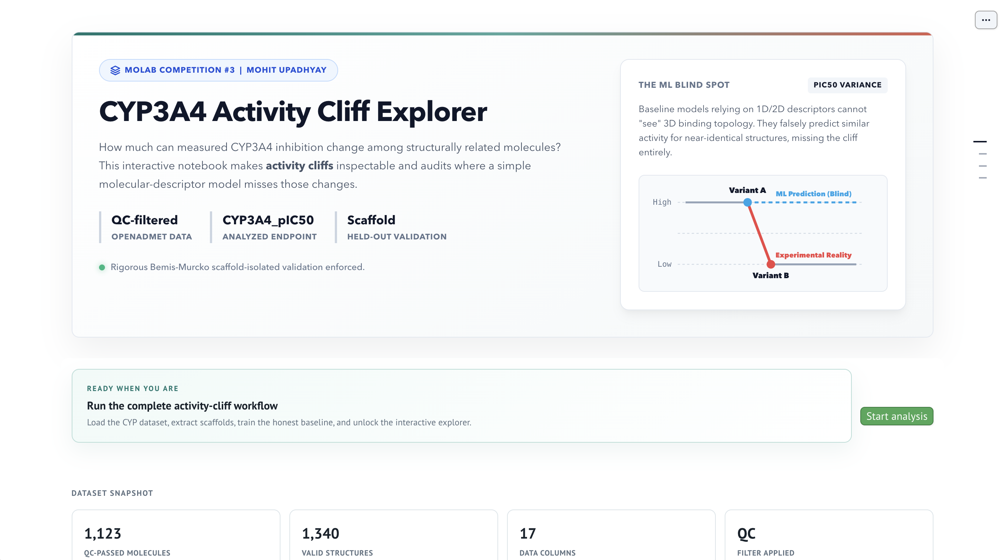
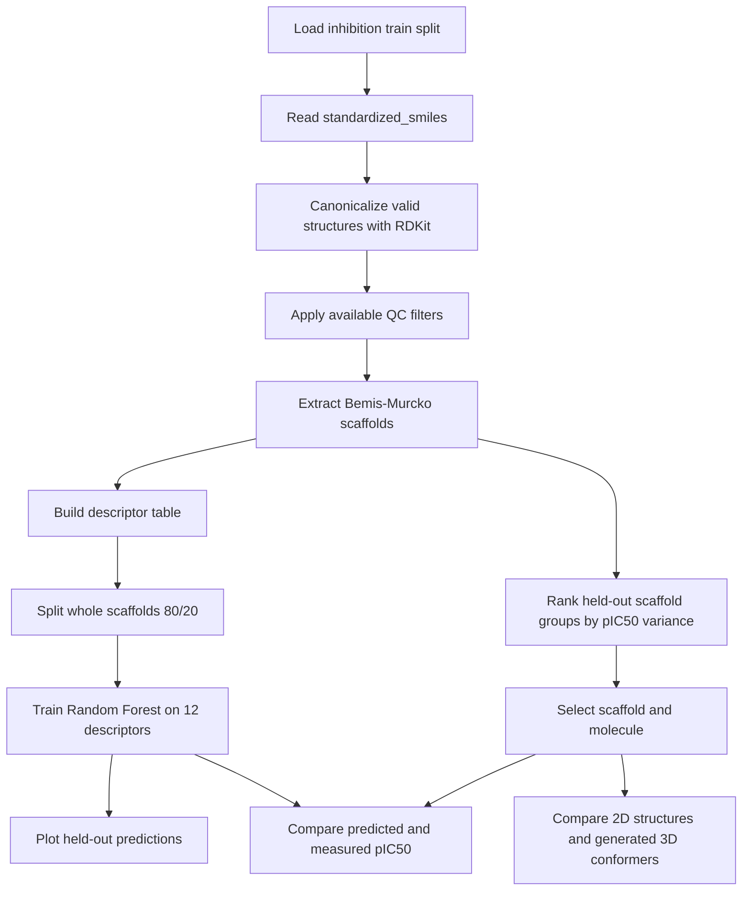
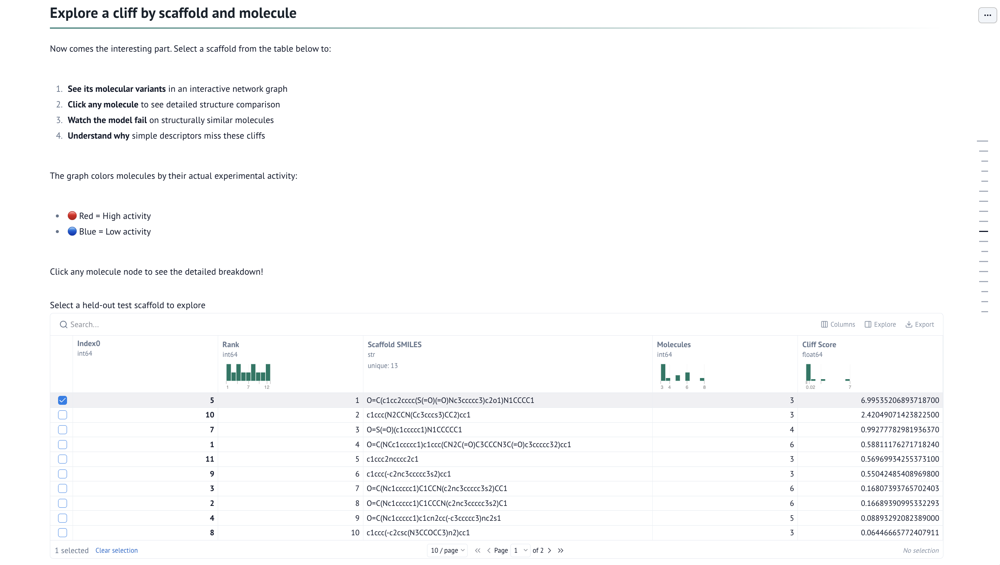
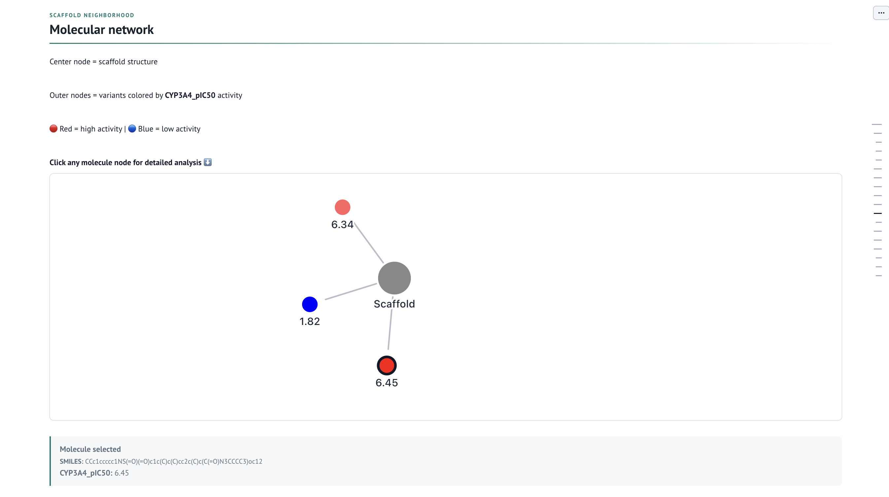
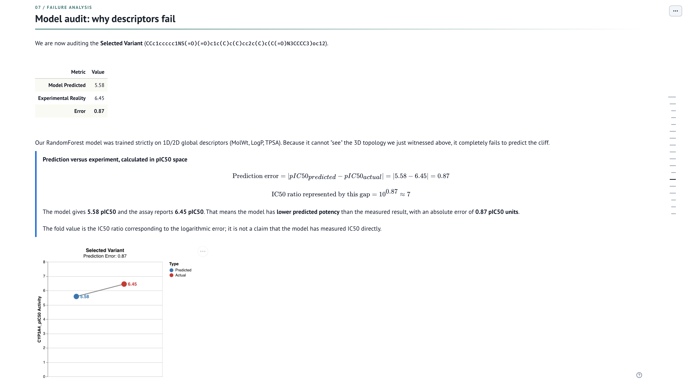

<h1 align="center">CYP3A4 Activity Cliff Explorer</h1>

<p align="center">
  <a href="https://github.com/Mohit5Upadhyay/cyp-activity-cliff-explorer-molab"></a>
  <a href="https://molab.marimo.io/notebooks/nb_42UQLfmfgsG7gTtyvohiDV"></a>
  <a href="https://www.youtube.com/watch?v=bxvZCxglKcA"></a>
  <a href="https://drive.google.com/file/d/1Z0xPQYT2GQsthXiwxx4e7h6QcebIeK6W/view?usp=sharing"></a>
  <a href="https://marimo.io/pages/events/notebook-competition-3"></a>
  <a href="https://huggingface.co/datasets/openadmet/Octant_CYP_inhibition_reactivity_blog_release"></a>
  <a href="LICENSE"></a>
</p>

<p align="center">
  An interactive marimo notebook for inspecting CYP3A4 inhibition activity cliffs<br>
  and auditing a simple 1D/2D molecular-descriptor baseline.
</p>

<p align="center">
  <a href="#open-the-notebook">Open the notebook</a> ·
  <a href="#how-it-works">How it works</a> ·
  <a href="#run-locally">Run locally</a> ·
  <a href="#methodology">Methodology</a>
</p>

<p align="center">
  
</p>

## What this project does

An activity cliff is a sharp change in measured biological activity among structurally related molecules. This notebook makes candidate cliffs inspectable in the OpenADMET Octant CYP inhibition dataset.

The workflow focuses on the `CYP3A4_pIC50` endpoint. It canonicalizes valid `standardized_smiles`, applies the available assay-quality filters, extracts Bemis-Murcko scaffolds, and ranks scaffold groups by the sample variance of their measured pIC50 values. The interactive explorer then connects a scaffold to its molecules, structural differences, generated 3D conformers, and descriptor-based model error.

The notebook is an educational and exploratory analysis. It does not establish a protein-bound mechanism, clinical risk, regulatory conclusion, or production-ready CYP3A4 predictor.

## Why it matters

CYP3A4 is an enzyme involved in the metabolism of many drugs. Its inhibition is therefore relevant to drug-drug-interaction research. `IC50` is the concentration required to reduce measured enzyme activity by 50% in an assay. `pIC50` expresses the concentration on a logarithmic scale:

$$\mathrm{pIC}_{50} = -\log_{10}(\mathrm{IC}_{50}\ [\mathrm{M}])$$

Lower IC50 means stronger inhibition, while higher pIC50 means stronger inhibition. For two measured pIC50 values:

$$\Delta\mathrm{pIC}_{50} = \mathrm{pIC}_{50,A} - \mathrm{pIC}_{50,B}$$
$$\frac{\mathrm{IC}_{50,B}}{\mathrm{IC}_{50,A}} = 10^{\Delta\mathrm{pIC}_{50}}$$

The notebook displays this calculation when a molecule and its same-scaffold comparison molecule are selected. It reports the ratio implied by the pIC50 difference; it does not convert the dataset values back to IC50 without an explicitly known concentration unit.

## How it works



## What you can inspect

- The selected held-out scaffold table and its within-scaffold cliff score.
- Molecules grouped around a Bemis-Murcko scaffold in an interactive graph.
- MCS-highlighted 2D structural differences.
- Generated 3D conformers for visual inspection. These are not experimentally determined binding poses.
- A formula-based potency callout showing which measured pIC50 is higher and the implied IC50 fold ratio.
- A Random Forest prediction-versus-measurement callout and dumbbell chart.
- A held-out global scatter plot with structure tooltips.

<p align="center">
  
</p>
<p align="center"><i>Scaffold-level activity-cliff candidates ranked from measured CYP3A4 pIC50 values.</i></p>

<p align="center">
  
</p>
<p align="center"><i>Interactive molecular neighborhood for a selected scaffold.</i></p>

<p align="center">
  
</p>
<p align="center"><i>Descriptor-model audit for a selected molecule.</i></p>

## Methodology

### Data preparation

The notebook loads the `train` split of the `inhibition` configuration from [`openadmet/Octant_CYP_inhibition_reactivity_blog_release`](https://huggingface.co/datasets/openadmet/Octant_CYP_inhibition_reactivity_blog_release). It reads `standardized_smiles`, canonicalizes valid structures with RDKit, and applies filters when these fields are present:

- `qc_flag_primary` must be `PASS`.
- `drc_qc_status` must be `PASS`.
- `rollover_status` must not be `TRUE` or `YES`.

### Scaffold ranking

Bemis-Murcko scaffolds are extracted from canonical SMILES. Groups with fewer than three non-null `CYP3A4_pIC50` values are skipped. The score used by the code is the pandas sample variance:

$$\mathrm{CliffScore}(s) = \mathrm{Var}(y_s) = \frac{1}{n_s-1}\sum_{i=1}^{n_s}(y_i - \bar{y}_s)^2$$

This is a candidate-screening score based on activity spread within a shared scaffold. It is not a formal universal definition of an activity cliff and does not itself prove pairwise structural similarity or mechanism.

### Model audit

The baseline is a `RandomForestRegressor` with 100 trees, `max_depth=10`, and `random_state=42`. It uses these 12 RDKit descriptors:

- Molecular weight, LogP, and TPSA.
- Hydrogen-bond donor and acceptor counts.
- Rotatable-bond count.
- Aromatic, aliphatic, and saturated ring counts.
- Total ring count, fraction CSP3, and heteroatom count.

The split is scaffold-based: whole scaffolds are assigned to an 80% training partition or a 20% test partition. The test metrics therefore measure performance on scaffolds excluded from training for this run. The model does not receive 3D conformers, protein structures, binding poses, or explicit spatial interaction features.

## Open the notebook

The interactive notebook is available on Molab:

**[Open this project in Molab](https://molab.marimo.io/notebooks/nb_42UQLfmfgsG7gTtyvohiDV)**

Watch the project walkthrough on [YouTube](https://www.youtube.com/watch?v=bxvZCxglKcA) or [Google Drive](https://drive.google.com/file/d/1Z0xPQYT2GQsthXiwxx4e7h6QcebIeK6W/view?usp=sharing).

The source repository is available at [github.com/Mohit5Upadhyay/cyp-activity-cliff-explorer-molab](https://github.com/Mohit5Upadhyay/cyp-activity-cliff-explorer-molab). The project page for [marimo Notebook Competition #3](https://marimo.io/pages/events/notebook-competition-3) provides the competition context.

## Run locally

### Requirements

- Python 3.10 or newer.
- Internet access for the first Hugging Face dataset download.
- A working RDKit installation supported by the project dependencies.

### Install and run

```bash
git clone https://github.com/Mohit5Upadhyay/cyp-activity-cliff-explorer-molab.git
cd cyp-activity-cliff-explorer-molab

python3 -m venv .venv
source .venv/bin/activate

python -m pip install --upgrade pip
python -m pip install -e .

# Interactive editor
marimo edit cyp_activity_cliff.py

# Run-only view
marimo run cyp_activity_cliff.py
```

The script also includes PEP 723 inline dependency metadata for compatible tools that run Python scripts with inline dependencies.

## References and documentation

- [Project repository](https://github.com/Mohit5Upadhyay/cyp-activity-cliff-explorer-molab)
- [OpenADMET Octant CYP inhibition dataset](https://huggingface.co/datasets/openadmet/Octant_CYP_inhibition_reactivity_blog_release)
- [marimo documentation](https://docs.marimo.io/)
- [marimo Notebook Competition #3](https://marimo.io/pages/events/notebook-competition-3)
- [RDKit](https://www.rdkit.org/)
- [wigglystuff](https://github.com/koaning/wigglystuff)

## License

This project is licensed under the MIT License. See [LICENSE](LICENSE).
