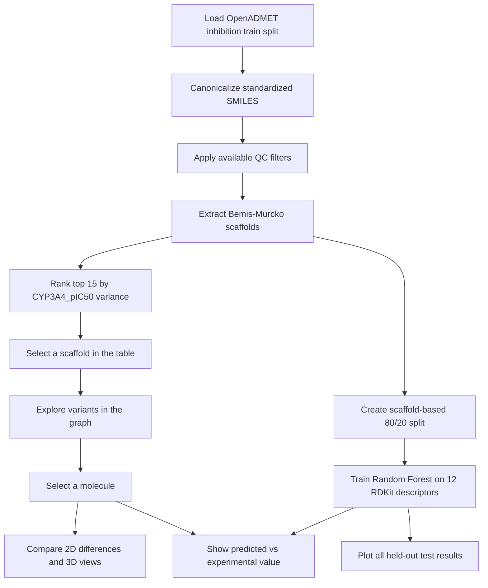

<h1 align="center">CYP3A4 Activity Cliff Explorer</h1>

<p align="center">
  <a href="https://marimo.io/pages/events/notebook-competition-3"></a>
  <a href="https://marimo.io"></a>
  <a href="https://huggingface.co/datasets/openadmet/Octant_CYP_inhibition_reactivity_blog_release"></a>
  <a href="LICENSE"></a>
</p>

<p align="center">
  <b>An interactive cheminformatics notebook for finding CYP3A4 activity cliffs<br>
  and inspecting where a simple molecular-descriptor model misses them.</b>
</p>

<p align="center">
  <a href="#run-the-notebook">Run the notebook</a> ·
  <a href="#how-it-works">How it works</a> ·
  <a href="#screenshots-and-demo">Screenshots and demo</a> ·
  <a href="#methodology">Methodology</a>
</p>

<p align="center">
  <a href="https://molab.marimo.io/notebooks"><strong>Open in molab</strong></a>
  &nbsp;·&nbsp;
  <a href="https://marimo.io/pages/events/notebook-competition-3"><strong>Competition page</strong></a>
  &nbsp;·&nbsp;
  <a href="https://huggingface.co/datasets/openadmet/Octant_CYP_inhibition_reactivity_blog_release"><strong>Dataset</strong></a>
</p>

<p align="center">
  
</p>

<p align="center"><i>Explore measured activity, compare related molecules, and audit model error in one notebook.</i></p>

---

## What this project does

An activity cliff is a group of structurally related molecules with substantially different measured activities. The notebook makes this pattern inspectable in the OpenADMET Octant CYP inhibition dataset.

The working app focuses on the `CYP3A4_pIC50` endpoint. It cleans valid structures, applies available assay QC filters, extracts Bemis-Murcko scaffolds, ranks scaffolds by within-scaffold variance, and opens an interactive path from scaffold selection to molecular comparison and model audit.

This is an educational analysis and visualization notebook. It is not a clinical, regulatory, or production prediction system.

## How it works



## What you can explore

- A ranked table of the 15 highest-variance scaffolds with at least three measured molecules.
- A `wigglystuff` molecular network centered on the selected scaffold.
- Activity-colored molecule nodes for the `CYP3A4_pIC50` endpoint.
- 2D structure comparison with MCS-based difference highlighting.
- Interactive 3D views for a selected molecule and a same-scaffold high-difference analog.
- A per-molecule dumbbell chart comparing Random Forest prediction with experimental value.
- A global held-out scatter plot with molecule structure tooltips and activity-cliff highlighting.

<p align="center">
  
</p>

<p align="center"><i>Scaffold ranking and molecular variant exploration.</i></p>

<p align="center">
  
</p>

<p align="center"><i>Selected molecule compared with a high-difference analog from the same scaffold.</i></p>

## Screenshots and demo


The repository does not currently contain a project-specific video URL. The official links below are the correct places to access the competition context, the live molab environment, and the source dataset:

- [Open the notebook workspace on molab](https://molab.marimo.io/notebooks)
- [Read about marimo Notebook Competition #3](https://marimo.io/pages/events/notebook-competition-3)
- [Inspect the OpenADMET dataset](https://huggingface.co/datasets/openadmet/Octant_CYP_inhibition_reactivity_blog_release)

<p align="center">
  
</p>

<p align="center"><i>Model audit: predicted versus experimental activity on held-out scaffolds.</i></p>

## Run the notebook

### Requirements

- Python 3.10 or newer
- Internet access for the first Hugging Face dataset download

### Local setup

```bash
git clone https://github.com/Mohit5Upadhyay/cyp-activity-cliff-explorer-molab.git
cd cyp-activity-cliff-explorer-molab
# Create a virtual environment named '.venv'
python3 -m venv .venv

# Activate the virtual environment
source .venv/bin/activate

# Install pip upgrade just to be safe
pip install --upgrade pip

# Install the project and all dependencies from pyproject.toml
pip install -e .

marimo edit cyp_activity_cliff.py  # edit mode

marimo run cyp_activity_cliff.py  # read only
```

`cyp_activity_cliff.py` also contains PEP 723 inline dependency metadata for compatible marimo environments.

### Run on molab

1. Open [molab notebooks](https://molab.marimo.io/github/Mohit5Upadhyay/cyp-activity-cliff-explorer-molab/blob/main/cyp_activity_cliff.py).
2. Upload `cyp_activity_cliff.py`.
3. Run the notebook.
4. Wait for dataset preparation, scaffold extraction, and model training to complete.

The notebook loads remote data and performs chemistry and model computations at runtime. Actual runtime depends on the environment and cache state.

## Methodology

### Data preparation

The app loads the `train` split of the `inhibition` configuration from:

```text
openadmet/Octant_CYP_inhibition_reactivity_blog_release
```

It reads `standardized_smiles`, canonicalizes valid molecules with RDKit, and filters rows when these QC columns are present:

- `drc_qc_status`
- `qc_flag_primary`
- `rollover_status`

### Scaffold analysis

The app extracts Bemis-Murcko scaffolds from canonical SMILES. Scaffolds with fewer than three non-null `CYP3A4_pIC50` values are skipped. The displayed ranking is sorted by within-scaffold variance and includes molecule count and cliff score.

### Model audit

The model is intentionally a simple baseline:

- `RandomForestRegressor` with 100 trees and `max_depth=10`.
- 12 RDKit descriptors: molecular weight, LogP, TPSA, hydrogen-bond counts, rotatable bonds, aromatic/aliphatic/saturated ring counts, total ring count, fraction CSP3, and heteroatom count.
- Scaffold-based 80/20 train/test split with `random_state=42`.
- Mean absolute error and $R^2$ for train and held-out test molecules.

The audit is designed to expose descriptor limitations. It should not be interpreted as a validated CYP3A4 predictor.

These tests cover backend behavior. The full notebook additionally requires access to the remote dataset and a marimo runtime.

## Data and references

- [OpenADMET Octant CYP inhibition and reactivity dataset](https://huggingface.co/datasets/openadmet/Octant_CYP_inhibition_reactivity_blog_release)
- [marimo Notebook Competition #3](https://marimo.io/pages/events/notebook-competition-3)
- [molab notebooks](https://molab.marimo.io/github/Mohit5Upadhyay/cyp-activity-cliff-explorer-molab/blob/main/cyp_activity_cliff.py)
- [marimo](https://marimo.io)
- [RDKit](https://www.rdkit.org/)
- [wigglystuff](https://github.com/koaning/wigglystuff)


## License

This project is licensed under the MIT License. See [LICENSE](LICENSE).

---

<p align="center">
  <b>Explore the data. Find the cliff. Audit the model.</b>
  <br><br>
  <a href="https://molab.marimo.io/github/Mohit5Upadhyay/cyp-activity-cliff-explorer-molab/blob/main/cyp_activity_cliff.py">Launch with molab</a>
</p>
